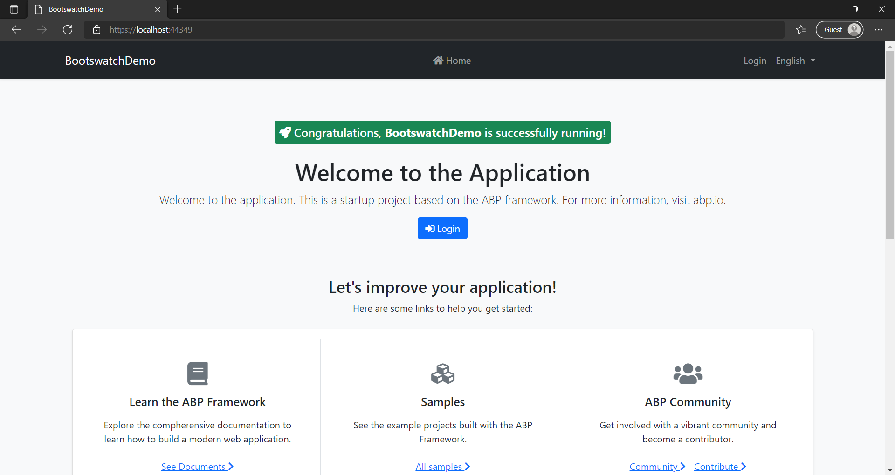
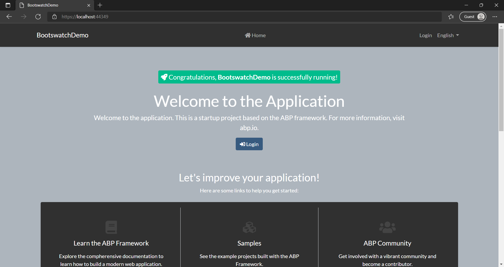
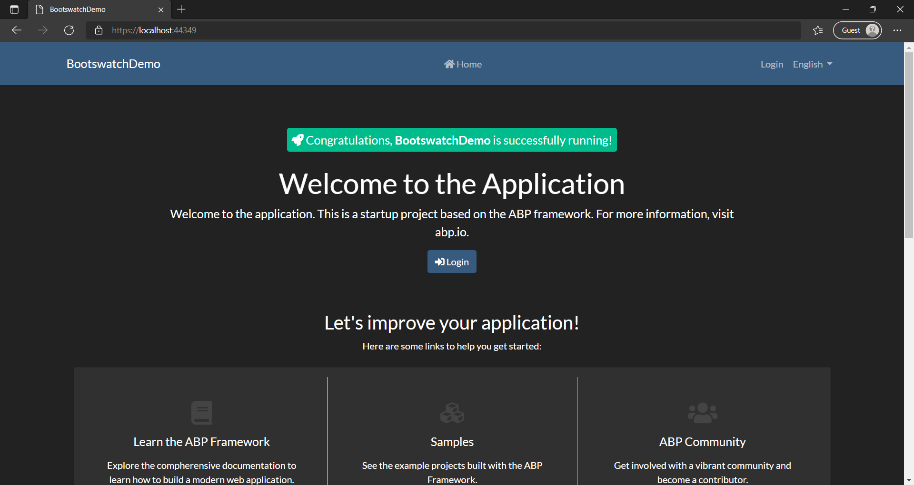
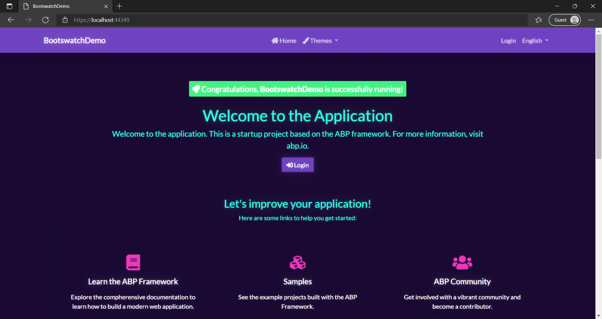

# Customizing the ABP Basic Theme with Bootswatch

While the ABP Basic Theme is a good starting point for your ABP app, you may want to add some more flair to it. We can accomplish this with Bootswatch.

## What is Bootswatch?

[Bootswatch](https://bootswatch.com/) is a collection of free open-source Bootstrap themes that act as slot-in replacements for Bootstrap. The website includes demos of how the different Bootstrap components look when styled by each of the themes.

## Getting started

This article assumes you have the [.NET](https://dot.net/) SDK and [Node.js](https://nodejs.org/) installed. Also, while not required, it is recommended to have [Yarn](https://yarnpkg.com/) installed.

Let's start by creating a new ABP project that we will add Bootswatch to.

Open a terminal. We will use the ABP CLI to create the project.

To make sure you have the ABP CLI installed and that it is up to date, run the following command:

```
dotnet tool update -g Volo.Abp.Cli
```

Now, navigate to the directory you would like the project to be in, and run the following command to create the project (assuming you are on Windows and have [SQL Server Express LocalDB](https://docs.microsoft.com/sql/database-engine/configure-windows/sql-server-express-localdb) installed):

```
abp new BootswatchDemo
```

If you do not have SQL Server Express LocalDB installed (or are on Linux or Mac), you can use a different database management system (DBMS) such as SQLite by using this command instead:

```
abp new BootswatchDemo -dbms SQLite
```

We should now have a starter app to work with in the **BootswatchDemo** directory.

Let's run the **BootswatchDemo.DbMigrator** project to setup the app's database. You can do this in the terminal while in the **BootswatchDemo.DbMigrator** project directory by running the following command:

```
dotnet run
```

Now, we can run the **BootswatchDemo.Web** project to see what the app looks like without any modifications.

If you open the app in your browser, you should get something like this:



Let's stop the app for now.

## Installing Bootswatch

We need to add Bootswatch to the **package.json** file in the **BootswatchDemo.Web** project directory. You can do this in the terminal while in the **BootswatchDemo.Web** project directory by running the following command (if you have yarn installed):

```
yarn add bootswatch
```

If you do not have yarn installed, you can instead use npm by running the following command:

```
npm install bootswatch
```

Now that we have Bootswatch added to the package.json file, we need to tell ABP that it is a client-side library that we are using.

To do this, we need to modify the **abp.resourcemapping.js** file in the **BootswatchDemo.Web** project directory to make it match the following:

```js
module.exports = {
    aliases: {
        "@node_modules": "./node_modules",
        "@libs": "./wwwroot/libs"
    },
    clean: [
        "@libs"
    ],
    mappings: {
        "@node_modules/bootswatch/dist/**/*.css": "@libs/bootswatch/",
    }
};
```

This tells ABP that the Bootswatch CSS files (located in the ./node_modules/bootswatch/dist/ directory) should be copied to the ./wwwroot/libs/bootswatch/ directory in the BootswatchDemo.Web project directory. Additionally, it will have ABP clean the ./wwwroot/libs directory each time it processes the client-side libraries so that it's always up to date and doesn't contain old files that aren't being used anymore.

Now that we've done this, we need to have ABP process the Bootswatch files. You can do this in the terminal while in the **BootswatchDemo.Web** project directory by running the following command:

```
abp install-libs
```

Bootswatch should now be installed into our project and we just need to wire it up to the ABP Basic Theme.

## Customizing the ABP Basic Theme with Bootswatch

Right now, the Bootswatch files should be in our project, but our app does not use them. To change this, we need to customize the ABP Basic Theme.

Inside the **BootswatchDemo.Web** project directory, create a sub-directory called **Bundling**. Inside the **Bundling** directory, create a file called **BootswatchStyleContributor.cs**.

The contents of the **BootswatchStyleContributor.cs** file should be:

```cs
using System.Collections.Generic;
using Volo.Abp.AspNetCore.Mvc.UI.Bundling;

namespace BootswatchDemo.Web.Bundling
{
    public class BootswatchStyleContributor : BundleContributor
    {
        public override void ConfigureBundle(BundleConfigurationContext context)
        {
            var theme = "darkly";

            context.Files.ReplaceOne(
                "/libs/bootstrap/css/bootstrap.css",
                $"/libs/bootswatch/{theme}/bootstrap.css"
            );
        }
    }
}
```

As you can see from the code, we are creating a BundleContributor that tells ABP to replace Bootstrap with a Bootswatch theme (in this case, we are using the Darkly theme).

Now we need to tell ABP about the **BootswatchStyleContributor**. To do this, open the **BootswatchDemoWebModule.cs** file in the **BootswatchDemo.Web** project directory.

We need to add a using statement to the top of the file:

```cs
using BootswatchDemo.Web.Bundling;
```

We also need to replace the `ConfigureBundles()` method with the following:

```cs
    private void ConfigureBundles()
    {
        Configure<AbpBundlingOptions>(options =>
        {
            options.StyleBundles.Configure(
                BasicThemeBundles.Styles.Global,
                bundle =>
                {
                    bundle.AddFiles("/global-styles.css");
                    bundle.AddContributors(typeof(BootswatchStyleContributor));
                }
            );
        });
    }
```

Now that ABP is using our BundleContributor, we can run the **BootswatchDemo.Web** project and we should be able to see the Darkly Bootswatch Theme being used.

If you open the app in your browser, you should get something like this:



Now while it looks different, it doesn't really match what the Bootswatch gallery shows for the Darkly theme. This is because of some assumptions that the ABP Basic Theme makes, but we can fix this.

Let's stop the app for now.

## Overriding Layouts and Components in the ABP Basic Theme

We need to override some of the layouts and components of the ABP Basic Theme to make our app match how the Bootswatch themes are supposed to look.

To do this, we will put modified versions of the ABP Basic Theme files that need to be overridden in the **BootswatchDemo.Web** project directory. By matching the same directory structure as the ABP Basic Theme, the files in the project will override the built-in ABP Basic Theme files.

For reference, the source code for the ABP Basic Theme is available on the abpframework/abp GitHub repository under [./modules/basic-theme/src/Volo.Abp.AspNetCore.Mvc.UI.Theme.Basic](https://github.com/abpframework/abp/tree/dev/modules/basic-theme/src/Volo.Abp.AspNetCore.Mvc.UI.Theme.Basic).

We need to add the following files to the **BootswatchDemo.Web** project directory which are modified from the source code for the ABP Basic Theme:

**Themes/Basic/Components/MainNavbar/Default.cshtml**:

```cs
@using Volo.Abp.AspNetCore.Mvc.UI.Theme.Basic.Themes.Basic.Components.Brand
@using Volo.Abp.AspNetCore.Mvc.UI.Theme.Basic.Themes.Basic.Components.Menu
@using Volo.Abp.AspNetCore.Mvc.UI.Theme.Basic.Themes.Basic.Components.Toolbar
<nav class="navbar navbar-expand-md navbar-dark bg-primary shadow-sm flex-column flex-md-row mb-4" id="main-navbar" style="min-height: 4rem;">
    <div class="container">
        @(await Component.InvokeAsync<MainNavbarBrandViewComponent>())
        <button class="navbar-toggler" type="button" data-bs-toggle="collapse"
                data-bs-target="#main-navbar-collapse" aria-controls="main-navbar-collapse"
                aria-expanded="false" aria-label="Toggle navigation">
            <span class="navbar-toggler-icon"></span>
        </button>
        <div class="collapse navbar-collapse" id="main-navbar-collapse">
            <ul class="navbar-nav mx-auto">
                @(await Component.InvokeAsync<MainNavbarMenuViewComponent>())
            </ul> 
            <ul class="navbar-nav"> 
                @(await Component.InvokeAsync<MainNavbarToolbarViewComponent>())
            </ul>
        </div>
    </div>
</nav>
```

In this file, we changed the `nav` element to use the `bg-primary` class instead of the `bg-dark` class.

**Themes/Basic/Layouts/Account.cshtml**:

```cs
@using Microsoft.Extensions.Localization
@using Microsoft.Extensions.Options
@using Volo.Abp.AspNetCore.MultiTenancy
@using Volo.Abp.AspNetCore.Mvc.UI.Components.LayoutHook
@using Volo.Abp.AspNetCore.Mvc.UI.MultiTenancy.Localization
@using Volo.Abp.AspNetCore.Mvc.UI.Theme.Basic.Bundling
@using Volo.Abp.AspNetCore.Mvc.UI.Theme.Basic.Themes.Basic.Components.MainNavbar
@using Volo.Abp.AspNetCore.Mvc.UI.Theme.Basic.Themes.Basic.Components.PageAlerts
@using Volo.Abp.AspNetCore.Mvc.UI.Theming
@using Volo.Abp.AspNetCore.Mvc.UI.Widgets.Components.WidgetScripts
@using Volo.Abp.AspNetCore.Mvc.UI.Widgets.Components.WidgetStyles
@using Volo.Abp.MultiTenancy
@using Volo.Abp.Localization
@using Volo.Abp.Ui.Branding
@inject IBrandingProvider BrandingProvider
@inject IOptions<AbpMultiTenancyOptions> MultiTenancyOptions
@inject ICurrentTenant CurrentTenant
@inject IStringLocalizer<AbpUiMultiTenancyResource> MultiTenancyStringLocalizer
@inject ITenantResolveResultAccessor TenantResolveResultAccessor

@{
    Layout = null;
    var containerClass = ViewBag.FluidLayout == true ? "container-fluid" : "container"; //TODO: Better and type-safe options
    var rtl = CultureHelper.IsRtl ? "rtl" : string.Empty;
}

<!DOCTYPE html>

<html lang="@CultureInfo.CurrentCulture.Name" dir="@rtl">
<head>
    @await Component.InvokeLayoutHookAsync(LayoutHooks.Head.First, StandardLayouts.Account)

    <meta charset="utf-8">
    <meta name="viewport" content="width=device-width, initial-scale=1, shrink-to-fit=no">
    <meta http-equiv="X-UA-Compatible" content="ie=edge">

    <title>@(ViewBag.Title == null ? BrandingProvider.AppName : ViewBag.Title)</title>

    @if (ViewBag.Description != null)
    {
        <meta name="description" content="@(ViewBag.Description as string)" />
    }
    <abp-style-bundle name="@BasicThemeBundles.Styles.Global" />

    @await RenderSectionAsync("styles", false)

    @await Component.InvokeAsync(typeof(WidgetStylesViewComponent))

    @await Component.InvokeLayoutHookAsync(LayoutHooks.Head.Last, StandardLayouts.Account)
</head>
<body class="abp-account-layout @rtl">
    @await Component.InvokeLayoutHookAsync(LayoutHooks.Body.First, StandardLayouts.Account)

    @(await Component.InvokeAsync<MainNavbarViewComponent>())

    <div class="@containerClass">
        <abp-row>
            <abp-column class="col mx-auto" style="max-width: 440px">
                @if (MultiTenancyOptions.Value.IsEnabled &&
                  (TenantResolveResultAccessor.Result?.AppliedResolvers?.Contains(CookieTenantResolveContributor.ContributorName) == true ||
                   TenantResolveResultAccessor.Result?.AppliedResolvers?.Contains(QueryStringTenantResolveContributor.ContributorName) == true))
                {
                    <div class="card shadow-sm rounded mb-3">
                        <div class="card-body px-5">
                            <div class="row">
                                <div class="col">
                                    <span style="font-size: .8em;" class="text-uppercase text-muted">@MultiTenancyStringLocalizer["Tenant"]</span><br />
                                    <h6 class="m-0 d-inline-block">
                                        @if (CurrentTenant.Id == null)
                                        {
                                            <span>
                                                @MultiTenancyStringLocalizer["NotSelected"]
                                            </span>
                                        }
                                        else
                                        {
                                            <strong>@(CurrentTenant.Name ?? CurrentTenant.Id.Value.ToString())</strong>
                                        }
                                    </h6>
                                </div>
                                <div class="col-auto">
                                    <a id="AbpTenantSwitchLink" href="javascript:;" class="btn btn-sm mt-3 btn-outline-primary">@MultiTenancyStringLocalizer["Switch"]</a>
                                </div>
                            </div>
                        </div>
                    </div>
                }
                @(await Component.InvokeAsync<PageAlertsViewComponent>())
                @await Component.InvokeLayoutHookAsync(LayoutHooks.PageContent.First, StandardLayouts.Account)
                @RenderBody()
                @await Component.InvokeLayoutHookAsync(LayoutHooks.PageContent.Last, StandardLayouts.Account)
            </abp-column>
        </abp-row>
    </div>

    <abp-script-bundle name="@BasicThemeBundles.Scripts.Global" />

    <script src="~/Abp/ApplicationConfigurationScript"></script>
    <script src="~/Abp/ServiceProxyScript"></script>

    @await RenderSectionAsync("scripts", false)

    @await Component.InvokeAsync(typeof(WidgetScriptsViewComponent))

    @await Component.InvokeLayoutHookAsync(LayoutHooks.Body.Last, StandardLayouts.Account)
</body>
</html>
```

In this file, we removed the `bg-light` class from the `body` element.

**Themes/Basic/Layouts/Application.cshtml**:

```cs
@using Volo.Abp.AspNetCore.Mvc.UI.Components.LayoutHook
@using Volo.Abp.AspNetCore.Mvc.UI.Layout
@using Volo.Abp.AspNetCore.Mvc.UI.Theme.Basic.Bundling
@using Volo.Abp.AspNetCore.Mvc.UI.Theme.Basic.Themes.Basic.Components.MainNavbar
@using Volo.Abp.AspNetCore.Mvc.UI.Theme.Basic.Themes.Basic.Components.PageAlerts
@using Volo.Abp.AspNetCore.Mvc.UI.Theming
@using Volo.Abp.AspNetCore.Mvc.UI.Widgets.Components.WidgetScripts
@using Volo.Abp.AspNetCore.Mvc.UI.Widgets.Components.WidgetStyles
@using Volo.Abp.Localization
@using Volo.Abp.Ui.Branding
@inject IBrandingProvider BrandingProvider
@inject IPageLayout PageLayout
@{
    Layout = null;
    var containerClass = ViewBag.FluidLayout == true ? "container-fluid" : "container"; //TODO: Better and type-safe options

    var pageTitle = ViewBag.Title == null ? BrandingProvider.AppName : ViewBag.Title; //TODO: Discard to get from Title

    if (PageLayout.Content.Title != null)
    {
        if (!string.IsNullOrWhiteSpace(pageTitle))
        {
            pageTitle = " | " + pageTitle;
        }

        pageTitle = PageLayout.Content.Title + pageTitle;
    }

    var rtl = CultureHelper.IsRtl ? "rtl" : string.Empty;
}

<!DOCTYPE html>

<html lang="@CultureInfo.CurrentCulture.Name" dir="@rtl">
<head>
    @await Component.InvokeLayoutHookAsync(LayoutHooks.Head.First, StandardLayouts.Application)

    <meta charset="utf-8">
    <meta name="viewport" content="width=device-width, initial-scale=1, shrink-to-fit=no">
    <meta http-equiv="X-UA-Compatible" content="ie=edge">

    <title>@pageTitle</title>

    <abp-style-bundle name="@BasicThemeBundles.Styles.Global" />

    @await Component.InvokeAsync(typeof(WidgetStylesViewComponent))

    @await RenderSectionAsync("styles", false)

    @await Component.InvokeLayoutHookAsync(LayoutHooks.Head.Last, StandardLayouts.Application)
</head>
<body class="abp-application-layout @rtl">
    @await Component.InvokeLayoutHookAsync(LayoutHooks.Body.First, StandardLayouts.Application)

    @(await Component.InvokeAsync<MainNavbarViewComponent>())

    <div class="@containerClass">
        @(await Component.InvokeAsync<PageAlertsViewComponent>())
        <div id="AbpContentToolbar">
            <div class="text-end mb-2">
                @RenderSection("content_toolbar", false)
            </div>
        </div>
        @await Component.InvokeLayoutHookAsync(LayoutHooks.PageContent.First, StandardLayouts.Application)
        @RenderBody()
        @await Component.InvokeLayoutHookAsync(LayoutHooks.PageContent.Last, StandardLayouts.Application)
    </div>

    <abp-script-bundle name="@BasicThemeBundles.Scripts.Global" />

    <script src="~/Abp/ApplicationConfigurationScript"></script>
    <script src="~/Abp/ServiceProxyScript"></script>

    @await Component.InvokeAsync(typeof(WidgetScriptsViewComponent))

    @await RenderSectionAsync("scripts", false)

    @await Component.InvokeLayoutHookAsync(LayoutHooks.Body.Last, StandardLayouts.Application)
</body>
</html>
```

In this file, we removed the `bg-light` class from the `body` element.

**Themes/Basic/_ViewImports.cshtml**:

```cs
@using System.Globalization
@addTagHelper *, Microsoft.AspNetCore.Mvc.TagHelpers
@addTagHelper *, Volo.Abp.AspNetCore.Mvc.UI.Bootstrap
@addTagHelper *, Volo.Abp.AspNetCore.Mvc.UI.Bundling
```

This file is left unchanged and is just needed for imports used in the other files.

Now that this is done, if we run the **BootswatchDemo.Web** project again, the app should look correct.

If you open the app in your browser, you should get something like this:



Now our app looks just like how the Darkly theme appears on the Bootswatch gallery.

Let's stop the app for now.

## Bonus: Adding Theme Switching

Since Bootswatch comes with so many themes, it might be nice if we could allow our users to choose which one they like the best.

We can add this functionality by adding a cookie that stores which theme the user has selected and use it to load a specific Bootswatch theme.

In the **BootswatchDemo.Web** project directory, create a file called **BootswatchDemoWebConsts.cs**. The contents of this file should be:

```cs
namespace BootswatchDemo.Web
{
    public static class BootswatchDemoWebConsts
    {
        public const string ThemeCookie = "theme";
        public const string DefaultTheme = "darkly";
    }
}
```

This file defines the name of the cookie we will use to store the user's selected theme as well as the default theme to use if the user has not made a selection.

Now, let's modify the **Bundling/BootswatchStyleContributor.cs** file that we created earlier in the **BootswatchDemo.Web** project directory.

Add the following using statements at the top of the file:

```cs
using Microsoft.AspNetCore.Http;
using Microsoft.Extensions.DependencyInjection;
```

Replace:

```cs
            var theme = "darkly";
```

With:

```cs
            var httpContext = context.ServiceProvider.GetService<IHttpContextAccessor>().HttpContext;
            
            if (!httpContext.Request.Cookies.TryGetValue(BootswatchDemoWebConsts.ThemeCookie, out var theme))
            {
                theme = BootswatchDemoWebConsts.DefaultTheme;
            }
```

This will have the **BootswatchStyleContributor** change the theme if the cookie is set.

We also need to provide a way for the user to change the theme. Let's create a Razor Page to handle setting the theme cookie.

Create a file in the **Pages** directory under the **BootswatchDemo.Web** project directory called **Theme.cshtml** with the following contents:

```cs
@page
@model BootswatchDemo.Web.Pages.ThemeModel
@{
}
```

Create another file in the same directory called **Theme.cshtml.cs** with the following contents:

```cs
using Microsoft.AspNetCore.Http;
using Microsoft.AspNetCore.Mvc;
using Microsoft.AspNetCore.Mvc.RazorPages;
using System;

namespace BootswatchDemo.Web.Pages
{
    public class ThemeModel : PageModel
    {
        public void OnGet(string theme, string returnUrl = null)
        {
            var options = new CookieOptions()
            {
                Expires = DateTime.UtcNow.AddYears(10)
            };

            HttpContext.Response.Cookies.Append(BootswatchDemoWebConsts.ThemeCookie, theme, options);
            
            HttpContext.Response.Redirect(returnUrl ?? Url.Content("~/"));
        }
    }
}
```

With these files, we can navigate a user to `~/Theme` with the selected theme provided as `theme` in the query string and it will set the cookie. It will then either redirect them to the front page, or a specific URL if there is a value for `returnUrl` provided in the query string.

Now, we need to setup a menu to allow the user to select the theme they want.

Open the **Menus/BootswatchDemoMenuContributor.cs** file under the **BootswatchDemo.Web** project directory.

Add the following using statements to the top of the file:

```cs
using Microsoft.AspNetCore.Http;
using Microsoft.AspNetCore.Mvc;
using Microsoft.AspNetCore.Mvc.Routing;
using Microsoft.Extensions.DependencyInjection;
using Microsoft.Extensions.Localization;
```

Replace the `ConfigureMainMenuAsync(MenuConfigurationContext)` method with:

```cs
    private async Task ConfigureMainMenuAsync(MenuConfigurationContext context)
    {
        var administration = context.Menu.GetAdministration();
        var l = context.GetLocalizer<BootswatchDemoResource>();

        context.Menu.Items.Insert(
            0,
            new ApplicationMenuItem(
                BootswatchDemoMenus.Home,
                l["Menu:Home"],
                "~/",
                icon: "fas fa-home",
                order: 0
            )
        );

        var themesMenu = new ApplicationMenuItem(
            "Themes",
            l["Menu:Themes"],
            icon: "fas fa-paint-brush");

        (string, LocalizedString)[] themes = new[]
        {
            ( "darkly", l["Menu:Themes:Darkly"] ),
            ( "flatly", l["Menu:Themes:Flatly"] ),
            ( "vapor", l["Menu:Themes:Vapor"] )
        };

        var httpContext = context.ServiceProvider.GetService<IHttpContextAccessor>().HttpContext;
        
        if (!httpContext.Request.Cookies.TryGetValue(BootswatchDemoWebConsts.ThemeCookie, out var theme))
        {
            theme = BootswatchDemoWebConsts.DefaultTheme;
        }

        foreach (var (name, displayName) in themes)
        {
            themesMenu.AddItem(new ApplicationMenuItem(
                name,
                displayName,
                url: $"~/Theme?theme={name}&returnUrl={httpContext.Request.Path}",
                cssClass: theme == name ? "active" : null));
        }

        context.Menu.Items.Add(themesMenu);

        if (MultiTenancyConsts.IsEnabled)
        {
            administration.SetSubItemOrder(TenantManagementMenuNames.GroupName, 1);
        }
        else
        {
            administration.TryRemoveMenuItem(TenantManagementMenuNames.GroupName);
        }

        administration.SetSubItemOrder(IdentityMenuNames.GroupName, 2);
        administration.SetSubItemOrder(SettingManagementMenuNames.GroupName, 3);
    }
```

This adds a menu for setting the Theme with three theme options (Darkly, Flatly, and Vapor). You can modify the `themes` variable to easily add, change, or remove the themes in the menu.

Since we added localized strings to the menu, we need to set them up. Under the **BootswatchDemo.Domain.Shared** project directory, open the **Localization/BootswatchDemo/en.json** file. Add the following to the end of the `"texts"` object:

```json
    "Menu:Themes": "Themes",
    "Menu:Themes:Darkly": "Darkly",
    "Menu:Themes:Flatly": "Flatly",
    "Menu:Themes:Vapor": "Vapor"
```

Finally, run the **BootswatchDemo.Web** project again and we should see the menu for selecting a theme.

If you open the app in your browser, you should get something like this:


And if you select the Vapor theme from the Themes menu, you should get something like this:


